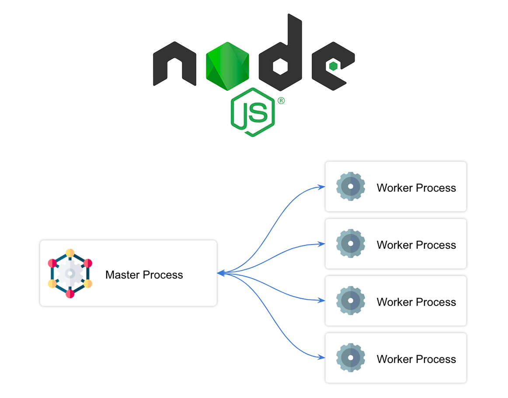
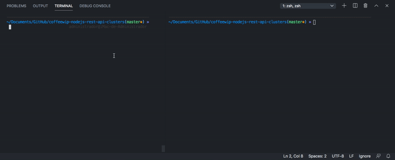

<p align="center">
  
</p>

<h1 align="center">Tutorial NodeJS REST API Cluster Performance</h1>

<p align="center">⚙️ Here you can find several examples on how to create an HTTP Server with and without Clusters with NodeJS and 🔥 Benchmarking Performance.</p>

<p align="center">
  <a title="MIT License" href="LICENSE.md">
    
  </a>
  <a title="Twitter: JoseJ_PR" href="https://twitter.com/JoseJ_PR">
    
  </a>  
  <a title="Github: Sponsors" href="https://github.com/sponsors/JoseJPR">
    
  </a>
  <br />
  <br />
</p>

<p align="center">
  
</p>

## 🔖 Description

📉 The performance of a NodeJS Project resides in the "Event Loop" concept and the number of processes that you can deploy. This feature can be affected by using in production environments of "console" and other synchronous functions.

## 📹 Video: NodeJS | Crea tu primera Rest API en NodeJS con Clusters

The following video shows how you can get the time that the require function need for each module.

[](https://youtu.be/IdhmcM79nNY)

## ✅ Prerequisites

In order to work with this project, your local environment must have at least the following versions:

* NodeJS Version: 13.xx
* NPM Version: 6.12.0

## 📐 How to work with this project

You have to do the following steps to be able to work with this project.

### 1️⃣ Install NodeJS Dependencies

To work with this project locally it is necessary to install the NPM dependencies.

```bash
# Install npm dependencies
$npm i
```

### 2️⃣ Run HTTP Server with or whithout Cluster

```bash
# HTTP Server.
$npm run http

# HTTP Server with console function.
$npm run http-1-cluster-console

# HTTP Server with stream function.
$npm run http-1-cluster-stream

# HTTP Server Cluster with one Master and one Worker with console function.
$npm run http-1-cluster-console

# HTTP Server Cluster with one Master and one Worker with stream function.
$npm run http-1-cluster-stream

# HTTP Server Cluster with one Master and four Worker with console function.
$npm run http-4-cluster-console

# HTTP Server Cluster with one Master and four Workers with stream function.
$npm run http-4-cluster-stream

# HTTP Server Cluster with one Master and four Workers with stream function and sending messages between the Master and the Workers.
$npm run http-4-cluster-stream-send
```

### 3️⃣ 🔥 Run Benchmarking App Testing

```bash
# Run Benchmarking Application for test HTTP Server.
$npm run benchmarking
```

You can see more information about AutoCannon here: [NPM autocannon](https://www.npmjs.com/package/autocannon)

## Results of some Tests Comparing with "console" and "stream" functions.

### HTTP CLUSTER with Four Workers and CONSOLE

Running 5s test @ http://localhost:3000
10 connections with 5 pipelining factor

```any
┌─────────┬──────┬──────┬───────┬───────┬────────┬─────────┬──────────┐
│ Stat    │ 2.5% │ 50%  │ 97.5% │ 99%   │ Avg    │ Stdev   │ Max      │
├─────────┼──────┼──────┼───────┼───────┼────────┼─────────┼──────────┤
│ Latency │ 0 ms │ 0 ms │ 8 ms  │ 11 ms │ 0.9 ms │ 2.31 ms │ 40.08 ms │
└─────────┴──────┴──────┴───────┴───────┴────────┴─────────┴──────────┘
┌───────────┬────────┬────────┬─────────┬─────────┬─────────┬─────────┬────────┐
│ Stat      │ 1%     │ 2.5%   │ 50%     │ 97.5%   │ Avg     │ Stdev   │ Min    │
├───────────┼────────┼────────┼─────────┼─────────┼─────────┼─────────┼────────┤
│ Req/Sec   │ 5491   │ 5491   │ 9927    │ 12063   │ 9378    │ 2249.39 │ 5490   │
├───────────┼────────┼────────┼─────────┼─────────┼─────────┼─────────┼────────┤
│ Bytes/Sec │ 741 kB │ 741 kB │ 1.34 MB │ 1.63 MB │ 1.27 MB │ 304 kB  │ 741 kB │
└───────────┴────────┴────────┴─────────┴─────────┴─────────┴─────────┴────────┘
```

Req/Bytes counts sampled once per second.

#### 47k requests in 5.13s, 6.33 MB read

----

### HTTP CLUSTER with Four Workers and STREAM

Running 5s test @ http://localhost:3000
10 connections with 5 pipelining factor

```any
┌─────────┬──────┬──────┬───────┬──────┬─────────┬─────────┬──────────┐
│ Stat    │ 2.5% │ 50%  │ 97.5% │ 99%  │ Avg     │ Stdev   │ Max      │
├─────────┼──────┼──────┼───────┼──────┼─────────┼─────────┼──────────┤
│ Latency │ 0 ms │ 0 ms │ 3 ms  │ 4 ms │ 0.48 ms │ 1.08 ms │ 22.71 ms │
└─────────┴──────┴──────┴───────┴──────┴─────────┴─────────┴──────────┘
┌───────────┬─────────┬─────────┬─────────┬─────────┬─────────┬─────────┬─────────┐
│ Stat      │ 1%      │ 2.5%    │ 50%     │ 97.5%   │ Avg     │ Stdev   │ Min     │
├───────────┼─────────┼─────────┼─────────┼─────────┼─────────┼─────────┼─────────┤
│ Req/Sec   │ 11759   │ 11759   │ 16639   │ 18879   │ 16139.2 │ 2514.56 │ 11754   │
├───────────┼─────────┼─────────┼─────────┼─────────┼─────────┼─────────┼─────────┤
│ Bytes/Sec │ 1.59 MB │ 1.59 MB │ 2.25 MB │ 2.55 MB │ 2.18 MB │ 340 kB  │ 1.59 MB │
└───────────┴─────────┴─────────┴─────────┴─────────┴─────────┴─────────┴─────────┘
```

Req/Bytes counts sampled once per second.

#### 81k requests in 5.1s, 10.9 MB read

## ⛽️ Review and Update Dependences

For review and update all npm dependences of this project you need install in global npm package "npm-check-updates" npm module.

```bash
# Install and Run
$npm i -g npm-check-updates
$ncu
```

## Happy Code

Created with JavaScript, lot of ❤️ and a few ☕️

## This README.md file has been written keeping in mind

- [GitHub Markdown](https://guides.github.com/features/mastering-markdown/)
- [Emoji Cheat Sheet](https://www.webfx.com/tools/emoji-cheat-sheet/)
